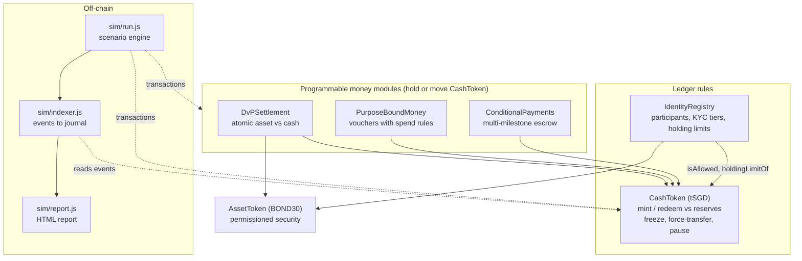
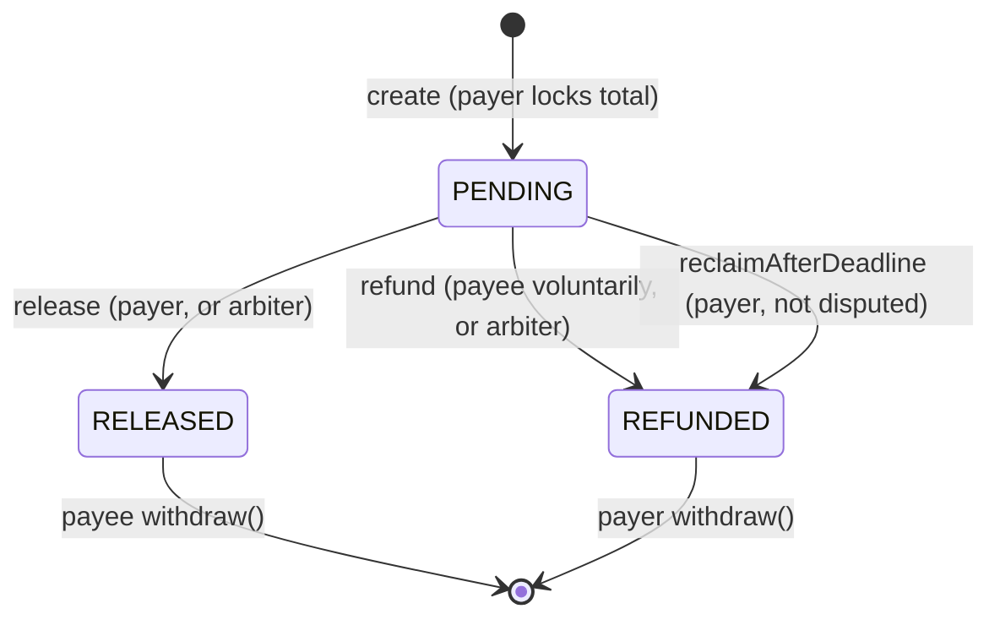
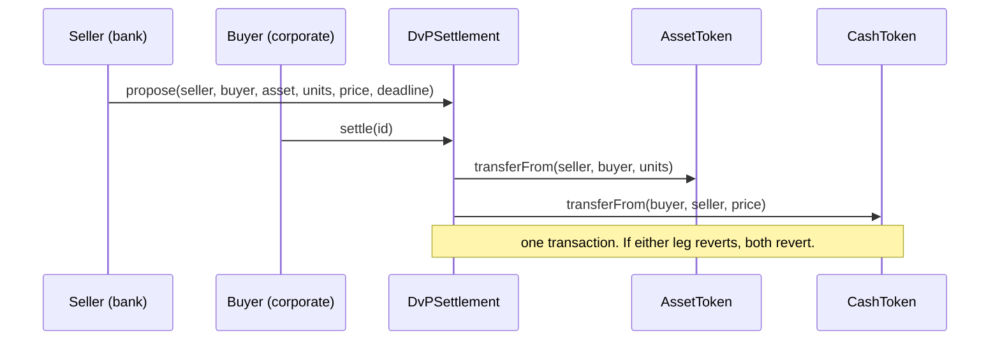

## Architecture

                     +-----------------------+
                     |   Identity Registry   |
                     |  (KYC, Tiers, Roles)  |
                     +-----------+-----------+
                                 |
                                 v
+-----------------------------------------------------------------+
|                         CashToken (tSGD)                        |
|   (Reserves-backed ERC-20 with freeze/pause & limit checks)     |
+--------+-----------------------+------------------------+-------+
         |                       |                        |
         v                       v                        v
+-----------------+   +--------------------+   +-------------------+
|  Purpose Bound  |   |    Conditional     |   |   DvP Settlement  |
|      Money      |   |      Payments      |   |   (Bond vs Cash)  |
|  (Vouchers/PBM) |   |  (Escrow/Milestone)|   |                   |
+-----------------+   +--------------------+   +-------------------+              

## Layers

Every module moves cash through `CashToken`, so **ledger rules are enforced once, in
`CashToken._update`, and apply everywhere**: a frozen merchant can't be paid by a voucher,
a sanctioned buyer can't settle a DvP trade, an unregistered address can't fund an escrow.
The modules are registered in the `IdentityRegistry` as `SYSTEM` participants so they can
custody cash.

## The cash token

| Concern | Rule |
| --- | --- |
| Backing | `mint` reverts if `totalSupply + amount > attestedReserves`. Reserves can't be attested below supply. |
| Redemption | Holders `redeem` (burn); the issuer pays fiat off-chain and lowers attested reserves. |
| Access | Sender and receiver must be registered and active. |
| Limits | Individuals are capped by KYC tier (`tierHoldingLimit`). Others are uncapped. |
| Freeze | Frozen accounts can't send, receive or redeem. |
| Force transfer | `COMPLIANCE_ROLE` can move funds out of a frozen account (court order). |
| Pause | `PAUSER_ROLE` halts every movement, including minting. |
| Payment data | `pay(to, amount, ref)` emits a `Payment` event with a bytes32 reference. |

Roles (`ISSUER_ROLE`, `COMPLIANCE_ROLE`, `PAUSER_ROLE`, `REGISTRAR_ROLE`) are all held by the
deployer in the prototype. In a real system they'd be separate keys or multisigs.

## Conditional payments (escrow v2)

The state applies per milestone. `dispute()` (either party, needs an arbiter) stops the payer
from releasing or reclaiming; only the arbiter can then settle. Settlement credits
`claimable`, and parties pull with `withdraw()`, so a frozen recipient never blocks
settlement.

Changes from the original `FreelanceMilestoneEscrow` POC:

| Original gap | Fix |
| --- | --- |
| One deployment per deal | One contract, many escrows by id |
| Native ETH | Permissioned tokenized cash |
| Paid out `address(this).balance` (forced ETH leaked into payouts) | Exact stored amounts |
| Funds locked forever if the freelancer vanished | Deadline + `reclaimAfterDeadline` |
| No dispute path | Optional arbiter + `dispute()` |
| A reverting recipient trapped funds | Pull payments |
| Single milestone | Any number of milestones |

## Purpose-bound money

A sponsor locks cash 1:1 and issues vouchers. Holders can only `spend` at merchants on the
programme's allowlist, before expiry, and the merchant receives ordinary cash. After expiry,
the sponsor reclaims all unspent value in one call. Vouchers are not transferable between
holders. The wrapper adds rules only and never creates money: `cash held == totalOutstanding`.

## DvP settlement

The contract never custodies either asset; both parties pre-approve it.

## Invariants

These are checked after every step in `test/Invariants.test.js` and at the end of every
simulation run:

1. Sum of all balances == `totalSupply`
2. `totalSupply <= attestedReserves`
3. `cash.balanceOf(ConditionalPayments) == totalLocked + totalClaimable`
4. `cash.balanceOf(PurposeBoundMoney) == totalOutstanding`
5. `cash.balanceOf(DvPSettlement) == 0`
6. No individual exceeds their tier's holding limit
7. A frozen account's balance never decreases (outside force-transfers)
8. (simulation only) Replaying the indexed journal reproduces every on-chain balance

## Simulation schedule (default, 14 days)

| Day | Scenario |
| --- | --- |
| 0 | Banks deposit reserves, issuer mints 1:1; corporate and agency accounts funded; payroll |
| every day | Retail POS and P2P payments; merchants sweep takings to their bank |
| 1 | 8 B2B multi-milestone escrows (4 with an arbiter) |
| 2 | Voucher programme for 30 residents, 4 approved merchants, 7-day expiry |
| 3 to 8 | Voucher spending (some attempts at non-approved merchants) |
| 3 / 5 | Escrow #2 disputed, then resolved by the arbiter |
| 4 | 5 DvP bond trades; the last fails atomically when the buyer is frozen mid-flow |
| 6 / 8 | Two accounts frozen (AML alert, court order); one cleared, one partially seized |
| 9 | Vouchers expire; sponsor reclaims unspent value |
| 10 | Ledger paused for an incident, then resumed |
| 11 | Escrow deadlines pass; buyers reclaim undelivered milestones |
| 12 | Redemption wave: 30% of individuals and one corporate cash out |
